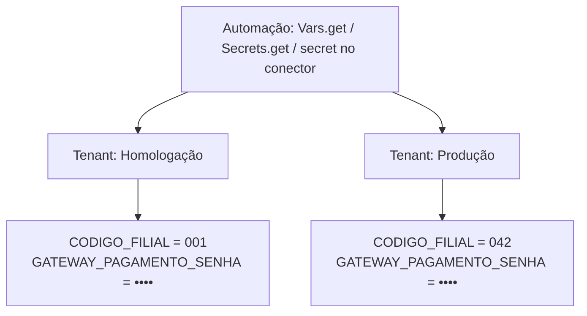

**Secrets e Variáveis** guarda, por tenant, os valores que uma automação precisa para rodar: senhas, tokens e chaves de sistemas externos, e também configurações comuns, como um código de filial ou uma URL. O código lê o valor pelo nome, e a plataforma entrega o valor do tenant que está executando.

Assim, o mesmo código roda em homologação e em produção sem nenhuma credencial escrita nele.

<Warning>
  Nunca escreva credenciais no código da automação, nem em arquivos do repositório. Cadastre o valor aqui e referencie pelo nome.
</Warning>

---

## Sensível ou não sensível

Cada valor é de um dos dois tipos. O tipo decide quem pode ver o valor e como o código pode usá-lo.

| | Variável (não sensível) | Sensível |
|---|---|---|
| **Exemplos** | URLs, códigos de filial, limites | Senhas, tokens, chaves de API |
| **No painel** | O valor aparece na lista | O valor nunca é exibido depois de salvo. Aparece só a impressão digital |
| **No código** | `Vars.get('NOME')` | `{{secret:NOME}}` na chamada do conector, ou `Secrets.get('NOME')` |
| **Na chamada REST** | Pode ir no corpo, em cabeçalho, na query ou no path | Só no corpo ou em cabeçalho |

Veja como usar cada um em [Secrets e Variáveis no Código](/devtools/utilitarios/secrets-e-variaveis).

<Tip>
  Quando a autenticação do sistema externo cabe na credencial do conector, continue usando [Credentials](/devtools/plataforma/credentials). Secrets e Variáveis resolve os casos em que o valor precisa ir em outro lugar da chamada, como usuário e senha dentro do corpo de um gateway de pagamentos em JSON-RPC, e as configurações que mudam de um tenant para outro.
</Tip>

---

## Gerenciando no painel

No DevTools, abra **Integração → Secrets e variáveis**. A lista mostra nome, tenant, tipo, valor (ou a impressão digital, para os sensíveis), versão e data da última alteração. Use o filtro de tenant para ver os valores de um ambiente.

### Criar

<Steps>
  <Step title="Abra o formulário">
    Clique em **Criar secret ou variável**.
  </Step>
  <Step title="Escolha o tenant">
    O valor vale só para esse tenant. Para usar o mesmo nome em outro ambiente, crie outro registro com o mesmo nome no outro tenant.
  </Step>
  <Step title="Dê um nome">
    Use letras maiúsculas, números e `_`, começando por letra, com até 64 caracteres (ex.: `GATEWAY_PAGAMENTO_SENHA`). O painel converte o que você digita para maiúsculas.
  </Step>
  <Step title="Marque se é sensível">
    Ligue **Sensível** para senhas, tokens e chaves. Depois de salvo, o valor não é mais exibido para ninguém.
  </Step>
  <Step title="Informe o valor e, se quiser, uma descrição">
    O valor aceita até 8192 bytes. A descrição é opcional, com até 500 caracteres.
  </Step>
</Steps>

Depois que você digita o nome, o formulário mostra como referenciá-lo no código.

| Regra | Limite |
|-------|--------|
| Nome | `^[A-Z][A-Z0-9_]{0,63}$`, único dentro do tenant |
| Valor | Obrigatório, até 8192 bytes |
| Descrição | Opcional, até 500 caracteres |
| Quantidade | Até 200 secrets e variáveis por tenant |

### Editar

- O **tenant** e o **nome** não mudam depois de criados. Para renomear, crie um novo e apague o antigo.
- Ao editar um valor **sensível**, o campo vem vazio. Deixar em branco mantém o valor atual. Abaixo do campo aparece a impressão digital e a versão do valor atual.
- Para transformar um valor sensível em variável, digite o valor de novo. Sem isso, o painel não salva.
- Trocar o valor ou o tipo cria uma nova **versão**. Editar só a descrição não muda a versão.

### Apagar

Ao apagar, as automações que usam o nome passam a receber erro. A ação não pode ser desfeita. Se precisar do nome de novo, crie-o outra vez.

### Propagação

Uma alteração vale para as automações em **até 60 segundos**, sem deploy e sem reiniciar nada.

---

## Impressão digital

Um valor sensível nunca volta do servidor. No lugar dele, o painel mostra uma **impressão digital** de 8 caracteres, calculada a partir do valor com uma chave da plataforma. Ela não permite descobrir o valor, mas permite compará-lo:

- **Detectar uma troca entre versões:** se a impressão mudou de uma versão para outra no histórico, o valor mudou.
- **Comparar dois secrets sem revelar nenhum:** impressões diferentes garantem valores diferentes. Impressões iguais indicam o mesmo valor (por exemplo, a mesma senha cadastrada em dois tenants).

---

## Histórico

Cada secret ou variável tem um **Histórico** com todas as alterações: a ação (criação, alteração ou exclusão), a versão, a impressão digital, quem fez e quando. O histórico nunca guarda nem mostra o valor.

---

## Permissões

O acesso é controlado pelo [IAM](/plataforma-kruzer/iam-permissoes), no módulo **api-ipaas**, recurso **Secrets e variáveis** (`secrets`):

| Ação | Permite |
|------|---------|
| `read` | Ver o menu, a lista e o histórico |
| `create` | Criar |
| `update` | Editar valor, tipo e descrição |
| `delete` | Apagar |
| `resolve` | Resolver valores em execução. É usada pelos runtimes da plataforma e não é necessária para usar o painel |

Sem `read`, o item não aparece no menu.

<Note>
  Uma permissão nova só vale depois que o usuário sai e entra de novo no painel. Para **contas de serviço**, salve a conta outra vez no IAM depois de conceder a permissão.
</Note>

---

## Onde funciona

| Runtime | Situação |
|---------|----------|
| [Triggers](/devtools/plataforma/triggers) (agendados e webhooks) | ✅ Disponível |
| [Consumers](/devtools/plataforma/consumers) | ✅ Disponível para consumers criados ou atualizados depois da atualização da plataforma |
| [API Gateway](/devtools/api-gateway/introducao) (endpoints de arquivo) | ✅ Disponível |
| Execução local com a [CLI](/devtools/cli) | Parcial: só variáveis, ou valores definidos no seu ambiente. Veja [Testando localmente](/devtools/utilitarios/secrets-e-variaveis#testando-localmente) |

---

## Próximos Passos

<CardGroup cols={2}>
  <Card title="Secrets e Variáveis no Código" icon="code" href="/devtools/utilitarios/secrets-e-variaveis">
    Use os valores com Vars.get, Secrets.get e no conector REST
  </Card>
  <Card title="Credentials" icon="key" href="/devtools/plataforma/credentials">
    Credenciais de conectores por tenant
  </Card>
  <Card title="Tenants" icon="building-user" href="/devtools/plataforma/tenants">
    Entenda o isolamento por tenant
  </Card>
  <Card title="Permissões no IAM" icon="user-shield" href="/plataforma-kruzer/iam-permissoes">
    Conceda acesso a usuários e contas de serviço
  </Card>
</CardGroup>
