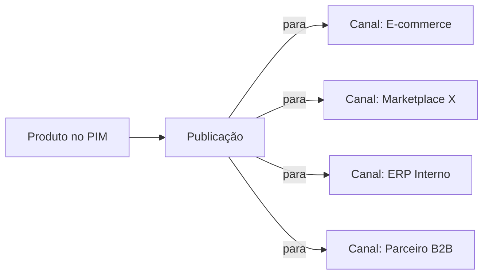

O **Canal** representa um destino de publicação do catálogo PIM — um e-commerce, marketplace, ERP, parceiro B2B ou qualquer sistema externo que consome dados de produto. A **Publicação** é a operação que envia o conteúdo do PIM para esse canal.

## Modelo

Um produto pode ser publicado em **múltiplos canais** simultaneamente. Cada canal tem seu próprio formato, regras e seleção de campos.

---

## Tipos de Canal

<CardGroup cols={2}>
  <Card title="E-commerce próprio" icon="cart-shopping">
    Plataforma de loja virtual da organização (Magento, VTEX, Shopify, etc.)
  </Card>
  <Card title="Marketplace" icon="store">
    Mercado Livre, Amazon, Magalu — cada um com regras específicas
  </Card>
  <Card title="ERP / Backoffice" icon="building">
    Sistemas corporativos que precisam dos dados de produto
  </Card>
  <Card title="Parceiros B2B" icon="handshake">
    Clientes corporativos que consomem o catálogo
  </Card>
</CardGroup>

---

## Configuração do Canal

Cada canal carrega:

- **Tipo** (define o formato e protocolo padrão)
- **Endpoint / credenciais** de destino
- **Mapeamento de campos** (de atributos PIM para campos do canal)
- **Filtros** (quais produtos elegíveis para este canal — por categoria, marca, atributo)
- **Cadência de publicação** (manual, agendada, em tempo real via webhook)

---

## Ciclo de Publicação

<Steps>
  <Step title="Seleção">
    O sistema identifica quais produtos são elegíveis para o canal — com base em filtros configurados e status (ex.: "aprovado").
  </Step>
  <Step title="Mapeamento">
    Os atributos do PIM são traduzidos para os campos esperados pelo canal de destino.
  </Step>
  <Step title="Envio">
    O conteúdo é enviado ao canal via API, arquivo ou outro protocolo configurado.
  </Step>
  <Step title="Confirmação">
    O canal retorna sucesso/erro. O PIM registra o status da publicação e disponibiliza para auditoria.
  </Step>
</Steps>

---

## Anúncios (Advertisements)

Em alguns contextos, especialmente marketplaces, a entidade publicada não é o produto bruto — é um **anúncio** ou **listing**, com título otimizado, copy promocional, imagens específicas e preços diferenciados. O PIM suporta gerenciar essas variações por canal sem perder a fonte única do produto.

---

## Reprocessamento e Histórico

- **Reprocessar** um canal envia novamente as informações dos produtos elegíveis.
- O PIM mantém histórico das publicações: o que foi enviado, quando e qual foi a resposta do canal.
- Falhas geram alertas que podem ser configurados para notificar via [SNS](/pim/funcionalidades/notificacoes) ou [webhooks](/pim/funcionalidades/webhooks).

---

## Próximos Passos

<CardGroup cols={2}>
  <Card title="Workflow de Aprovação" icon="route" href="/pim/conceitos/workflow-de-aprovacao">
    Garantir qualidade antes de publicar
  </Card>
  <Card title="Webhooks" icon="bell" href="/pim/funcionalidades/webhooks">
    Notificar sistemas externos sobre mudanças
  </Card>
  <Card title="Notificações" icon="bell-on" href="/pim/funcionalidades/notificacoes">
    Alertas em tempo real
  </Card>
</CardGroup>
