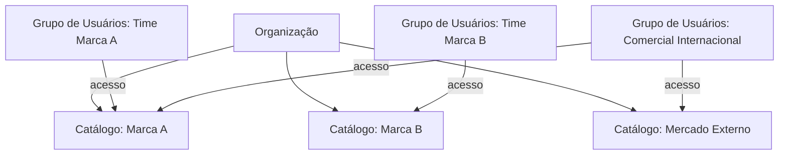

O **Catálogo** é a unidade de isolamento de dados do PIM. Toda informação de produto — desde a entidade `Product` até suas categorias, atributos e mídias — vive dentro de um catálogo. É o que permite que uma mesma instância do PIM atenda múltiplas marcas, unidades de negócio ou clientes sem misturar dados.

## Modelo Multi-Tenant

- **Catálogos** isolam **dados**: produtos, categorias, atributos, famílias.
- **Grupos de usuários** controlam **quem acessa o quê**: um grupo pode ter acesso a um ou mais catálogos.
- Um usuário pertence a grupos, que por sua vez têm acesso a catálogos.

---

## Quando Usar Múltiplos Catálogos

<CardGroup cols={2}>
  <Card title="Múltiplas marcas" icon="building">
    Cada marca da organização tem seu próprio sortimento, categorização e regras
  </Card>
  <Card title="Mercados distintos" icon="globe">
    Brasil, Argentina, México — produtos, idiomas e preços diferentes
  </Card>
  <Card title="Operações B2B/B2C" icon="users">
    Catálogos separados para revenda e para consumidor final
  </Card>
  <Card title="Sandbox vs Produção" icon="flask">
    Um catálogo de testes para experimentar configurações sem risco
  </Card>
</CardGroup>

---

## Como o Acesso é Aplicado

Toda requisição do usuário (interface ou API) passa por uma camada que filtra os dados visíveis aos catálogos que **os grupos do usuário** têm acesso. Isso significa:

- Um usuário só vê produtos dos catálogos que pode acessar.
- Tentativas de acessar dados de outros catálogos retornam erro de permissão.
- Operações em massa (importação, exportação) ficam restritas ao(s) catálogo(s) selecionado(s) na operação.

<Note>
  A configuração de **quais grupos têm acesso a quais catálogos** é feita pelo administrador da organização na seção **Permissões** da plataforma.
</Note>

---

## Catálogo vs. Categoria

Não confunda:

- **Catálogo** = isolamento de dados (multi-tenant). Mudou de catálogo = base de dados completamente separada.
- **Categoria** = taxonomia de classificação. Produtos dentro do mesmo catálogo são organizados em árvores de categorias.

Ver [Categorias](/pim/conceitos/categorias) para o modelo de classificação.

---

## Próximos Passos

<CardGroup cols={2}>
  <Card title="Produtos e SKUs" icon="tag" href="/pim/conceitos/produtos-e-skus">
    A entidade central do PIM
  </Card>
  <Card title="Permissões" icon="users-gear" href="/plataforma-kruzer/iam-permissoes">
    Modelo RBAC e grupos
  </Card>
</CardGroup>
