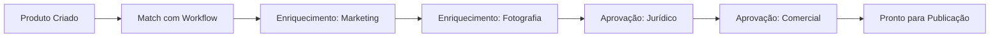

O **Workflow de Aprovação** é o mecanismo do PIM para garantir que produtos passem por etapas de enriquecimento e revisão antes de serem disponibilizados ao público. É a feature mais sofisticada do módulo — permite operações multi-time onde marketing, jurídico, comercial e fotografia colaboram em um produto.

## Conceito

Um workflow define uma sequência de **etapas (steps)** pelas quais um produto deve passar. Cada etapa tem:

- **Responsável** (grupo de usuários encarregado)
- **Escopo** (quais informações podem ser editadas — ex.: apenas mídia, apenas atributos técnicos)
- **Tipo** (enriquecimento ou aprovação)
- **SLA** (prazo esperado para conclusão)

---

## Matching Automático

Ao criar ou atualizar um produto, o PIM avalia critérios para decidir qual workflow se aplica. Os critérios podem combinar:

- **Categoria** (produtos de "Cosméticos" passam pelo workflow de regulatório)
- **Marca** (produtos de marcas premium passam por aprovação adicional)
- **Família** (eletrônicos passam por validação técnica)
- **Atributos específicos** (qualquer produto importado tem revisão de qualidade)

Um produto é matchado com **um workflow por vez**. Caso múltiplos sejam elegíveis, regras de prioridade decidem qual aplica.

---

## Tipos de Etapa

<CardGroup cols={2}>
  <Card title="Enriquecimento" icon="wand-magic-sparkles">
    Etapa de adicionar/completar informações: textos, imagens, atributos, traduções
  </Card>
  <Card title="Aprovação" icon="circle-check">
    Etapa de revisão sem modificação: aprovar/rejeitar/devolver para etapa anterior
  </Card>
</CardGroup>

Cada etapa pode definir um **escopo** — quais conjuntos de campos estão liberados para edição naquela etapa. Exemplos: `basic_info`, `attributes`, `media`, `technical_specs`.

---

## Fila de Trabalho

Cada usuário enxerga sua **fila de trabalho** com os produtos atribuídos a ele em etapas onde seu grupo é responsável. O sistema:

- **Ordena por SLA** (mais atrasados primeiro)
- **Bloqueia edição concorrente** (lock temporário enquanto um usuário está editando)
- **Rastreia tempo gasto** em cada etapa
- **Notifica atrasos** via [notificações](/pim/funcionalidades/notificacoes) ou [webhooks](/pim/funcionalidades/webhooks)

---

## Snapshots e Auditoria

A cada transição de etapa o PIM captura um **snapshot** do produto:

- O que estava preenchido antes da etapa
- O que foi modificado durante a etapa
- Quem fez a modificação e quando

Isso permite **diff completo** entre estados, auditoria regulatória e reversão segura quando necessário.

---

## Rejeição e Retorno

Etapas de aprovação podem **rejeitar** o produto, devolvendo-o para uma etapa anterior com observações. O ciclo continua até que todas as etapas estejam aprovadas — quando o produto fica elegível para [publicação em canais](/pim/conceitos/canais-e-publicacao).

---

## Notificações de Workflow

O sistema dispara notificações em vários momentos:

- Novo item na fila de um grupo
- Etapa próxima do SLA
- Etapa em atraso
- Produto rejeitado
- Workflow concluído

As notificações usam o serviço [SNS](/pim/funcionalidades/notificacoes) interno do PIM (em tempo real na interface) e podem disparar [webhooks](/pim/funcionalidades/webhooks) para sistemas externos.

---

## Próximos Passos

<CardGroup cols={2}>
  <Card title="Canais e Publicação" icon="rss" href="/pim/conceitos/canais-e-publicacao">
    O que vem depois da aprovação
  </Card>
  <Card title="Webhooks" icon="bell" href="/pim/funcionalidades/webhooks">
    Integrar workflows com sistemas externos
  </Card>
  <Card title="Notificações" icon="bell-on" href="/pim/funcionalidades/notificacoes">
    Alertas em tempo real para os times
  </Card>
</CardGroup>
