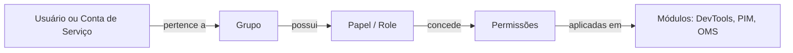

A Kruzer adota o modelo **RBAC** (*Role-Based Access Control*) para controlar quem pode fazer o quê dentro da plataforma. As permissões são geridas centralmente pelo IAM e valem para todos os módulos (DevTools, PIM e OMS).

## Conceitos Centrais

<CardGroup cols={2}>
  <Card title="Usuário" icon="user">
    Pessoa real com login na plataforma
  </Card>
  <Card title="Conta de Serviço" icon="robot">
    Identidade não-humana usada por integrações
  </Card>
  <Card title="Papel (Role)" icon="user-tag">
    Conjunto nomeado de permissões (ex.: "Editor de Produto", "Administrador PIM")
  </Card>
  <Card title="Grupo" icon="users">
    Conjunto de usuários e papéis aplicado em bloco
  </Card>
</CardGroup>

---

## Como Funciona

- Um **usuário** pertence a um ou mais **grupos**.
- Cada **grupo** possui um ou mais **papéis**.
- Cada **papel** carrega **permissões** específicas (ex.: ler produtos, publicar release de API, executar automação).
- As permissões são avaliadas pelos módulos a cada requisição.

---

## Boas Práticas

<AccordionGroup>
  <Accordion title="Use grupos, não atribua papéis diretamente a usuários">
    Atribuir papéis individualmente a cada usuário gera bagunça em operações como onboarding/offboarding. Crie grupos por função organizacional ("Time de Marketing", "Engenharia PIM") e atribua papéis aos grupos.
  </Accordion>

  <Accordion title="Princípio do menor privilégio">
    Conceda apenas as permissões estritamente necessárias para a função. É mais fácil ampliar acessos do que descobrir um vazamento por excesso de permissão.
  </Accordion>

  <Accordion title="Contas de serviço com escopo restrito">
    Para integrações, crie uma conta de serviço dedicada por integração — não reutilize a mesma conta para múltiplos sistemas externos. Isso facilita rotação de credenciais e auditoria.
  </Accordion>

  <Accordion title="Revise periodicamente">
    Estabeleça uma cadência (ex.: trimestral) para revisar quem tem acesso a quê. Permissões "esquecidas" são uma fonte comum de incidentes.
  </Accordion>
</AccordionGroup>

---

## Permissões por Módulo

Cada módulo expõe seu próprio conjunto de permissões granulares:

- **DevTools** — gerenciar repositórios, conectores, credenciais; criar e executar automações; configurar gateways e releases.
- **PIM** — ler/escrever produtos, gerenciar atributos e categorias, aprovar workflows, importar/exportar em massa, publicar em canais.
- **Plataforma** — administrar usuários, grupos, papéis e contas de serviço.

> A lista completa de permissões disponíveis e o mapeamento com cada papel padrão fica visível para administradores na seção **Permissões** da plataforma.

---

## Próximos Passos

<CardGroup cols={2}>
  <Card title="Autenticação" icon="right-to-bracket" href="/plataforma-kruzer/iam-autenticacao">
    Modelos de autenticação (usuário e conta de serviço)
  </Card>
  <Card title="SSO Corporativo" icon="building-shield" href="/plataforma-kruzer/sso">
    Integração com Microsoft / Azure AD
  </Card>
</CardGroup>
