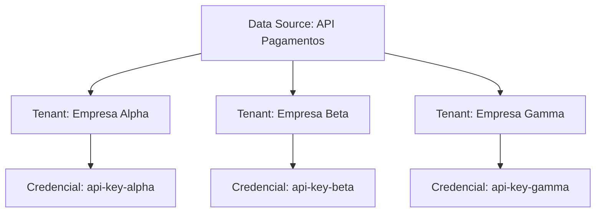

**Credentials** é o sistema de gerenciamento de credenciais da plataforma Kruzer, que permite configurar autenticações específicas para cada tenant em cada Data Source.

## Conceito

Na arquitetura multi-tenant do iPaaS Kruzer, um mesmo Data Source (conector) pode ser utilizado por múltiplos tenants, porém cada tenant possui suas próprias credenciais de acesso.



## Como Funciona

<Steps>
  <Step title="Data Source Configurado">
    Um Data Source é criado com as configurações base (endpoint, tipo de autenticação, etc).
  </Step>
  <Step title="Credenciais por Tenant">
    Cada tenant configura suas próprias credenciais para aquele Data Source.
  </Step>
  <Step title="Execução Isolada">
    Quando a automação executa, a plataforma injeta automaticamente as credenciais do tenant correto.
  </Step>
</Steps>

---

## Exemplo Prático

### Cenário

Uma API de pagamentos (`api-pagamentos`) é utilizada por três empresas diferentes. Cada empresa tem sua própria API Key.

### Configuração na Plataforma

| Tenant | Data Source | Credencial |
|--------|-------------|------------|
| Empresa Alpha | api-pagamentos | `pk_alpha_xxx123` |
| Empresa Beta | api-pagamentos | `pk_beta_yyy456` |
| Empresa Gamma | api-pagamentos | `pk_gamma_zzz789` |

### Código da Automação

O código permanece o mesmo para todos os tenants:

```typescript
import { RestDataSource, KrzLogger } from '@kruzer/idk';

const logger = new KrzLogger('info', 'processar-pagamento');
const pagamentos = new RestDataSource('api-pagamentos');

export default async function run(params: { valor: number; descricao: string }) {
  // A credencial correta é injetada automaticamente
  // baseada no tenant que está executando
  const response = await pagamentos.request('POST', '/charges', {
    body: {
      amount: params.valor,
      description: params.descricao
    }
  });

  logger.info('Pagamento processado', { chargeId: response.id });
  return response;
}
```

<Tip>
  O desenvolvedor não precisa se preocupar com qual credencial usar. A plataforma gerencia isso automaticamente baseado no tenant que está executando a automação.
</Tip>

---

## Tipos de Credenciais

Dependendo do tipo de Data Source, diferentes credenciais podem ser configuradas:

<AccordionGroup>
  <Accordion title="REST API">
    - **API Key**: Chave de API
    - **Bearer Token**: Token de acesso
    - **Basic Auth**: Usuário e senha
    - **OAuth 2.0**: Client ID, Client Secret, tokens
  </Accordion>

  <Accordion title="Bancos de Dados">
    - **Usuário**: Nome de usuário do banco
    - **Senha**: Senha de acesso
    - **Connection String**: String de conexão completa (opcional)
  </Accordion>

  <Accordion title="SAP RFC">
    - **Usuário SAP**: Usuário de sistema
    - **Senha**: Senha do usuário
    - **Mandante**: Número do mandante
  </Accordion>
</AccordionGroup>

---

## Segurança

<CardGroup cols={2}>
  <Card title="Criptografia" icon="lock">
    Todas as credenciais são armazenadas criptografadas
  </Card>
  <Card title="Isolamento" icon="shield">
    Tenants não têm acesso às credenciais de outros tenants
  </Card>
  <Card title="Auditoria" icon="clipboard-list">
    Acessos às credenciais são registrados para auditoria
  </Card>
  <Card title="Rotação" icon="rotate">
    Suporte a rotação de credenciais sem downtime
  </Card>
</CardGroup>

<Warning>
  Nunca exponha credenciais no código ou em logs. A plataforma gerencia as credenciais de forma segura e as injeta automaticamente durante a execução.
</Warning>

---

## Testando Localmente

Ao usar a CLI para executar automações localmente, você deve:

1. Fazer login com `krz login`
2. Selecionar o tenant com `krz select tenant`

A CLI automaticamente utiliza as credenciais do tenant selecionado.

```bash
# Seleciona o tenant para teste
krz select tenant

# Executa a automação com as credenciais do tenant
krz run processar-pagamento -p ./params.json
```

## Próximos Passos

<CardGroup cols={2}>
  <Card title="CLI" icon="terminal" href="/cli">
    Configure a CLI para testes locais
  </Card>
  <Card title="Conectores" icon="plug" href="/plataforma/conectores">
    Configure conectores na plataforma
  </Card>
</CardGroup>
