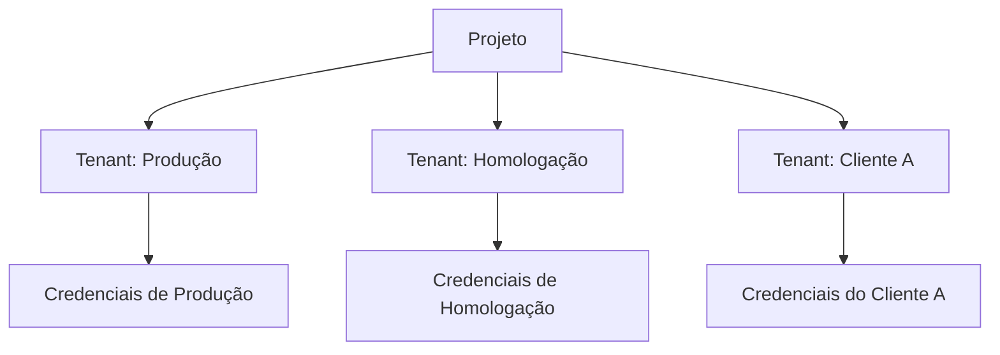

**Tenants** são separadores lógicos dentro da plataforma Kruzer que permitem isolar credenciais, triggers e execuções para diferentes contextos, como clientes, ambientes ou unidades de negócio.

## Conceito

Um tenant representa um contexto isolado de execução. Quando você configura um tenant, todas as automações executadas nesse contexto utilizam as credenciais específicas daquele tenant para acessar os conectores.



## Criando um Tenant

Para criar um tenant na plataforma, basta informar:

| Campo | Descrição |
|-------|-----------|
| Nome | Identificador único do tenant |
| Descrição | Descrição do propósito do tenant |

<Tip>
  Use nomes descritivos que identifiquem claramente o contexto, como `producao`, `homologacao`, `cliente-xyz` ou `loja-sp`.
</Tip>

## Relação com Outros Recursos

### Credentials

Cada tenant possui suas próprias credenciais para os conectores. Isso permite que o mesmo código de automação seja executado em diferentes contextos, utilizando credenciais específicas.

```typescript
// O mesmo código funciona para todos os tenants
const api = new RestDataSource('api-pagamentos');

// A plataforma injeta automaticamente as credenciais
// do tenant que está executando a automação
await api.request('POST', '/charges', { body: { amount: 100 } });
```

### Triggers

Triggers podem ser configurados por tenant, permitindo que automações sejam executadas em horários ou condições diferentes dependendo do contexto.

| Tenant | Trigger | Horário |
|--------|---------|---------|
| Produção | sync-estoque | A cada 15 minutos |
| Homologação | sync-estoque | A cada 1 hora |
| Cliente A | sync-estoque | A cada 30 minutos |

## Casos de Uso

<CardGroup cols={2}>
  <Card title="Multi-Cliente" icon="users">
    Isole dados e credenciais de diferentes clientes em uma mesma aplicação
  </Card>
  <Card title="Ambientes" icon="layer-group">
    Separe produção, homologação e desenvolvimento com credenciais distintas
  </Card>
  <Card title="Unidades de Negócio" icon="building">
    Configure credenciais específicas para diferentes filiais ou departamentos
  </Card>
  <Card title="Testes" icon="flask">
    Crie tenants de teste com credenciais de sandbox para validação
  </Card>
</CardGroup>

## Selecionando Tenant na CLI

Ao desenvolver localmente, use a CLI para selecionar o tenant:

```bash
# Lista e seleciona o tenant
krz select tenant

? Tenant:
  ❯ producao
    homologacao
    cliente-a

✔ Tenant selected successfully
```

Após selecionar, todas as execuções via `krz run` utilizarão as credenciais do tenant selecionado.

## Próximos Passos

<CardGroup cols={2}>
  <Card title="Credentials" icon="key" href="/plataforma/credentials">
    Configure credenciais específicas por tenant
  </Card>
  <Card title="Triggers" icon="bolt" href="/plataforma/triggers">
    Configure gatilhos por tenant
  </Card>
</CardGroup>
